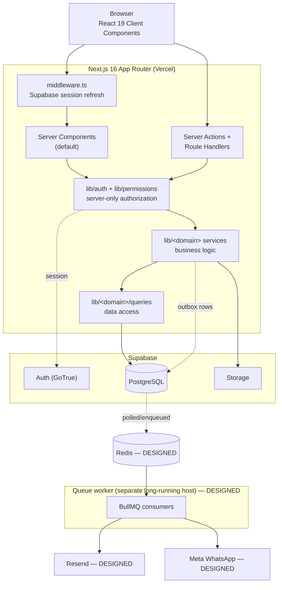

# Architecture

This document records the foundational architecture required by specification Section 159. It is
written **before** major application code and is the reference the implementation is built against.

Every section is tagged:

- **IMPLEMENTED** — built and present in this repository now (Phase 1).
- **DESIGNED** — decided and specified here, implemented in a later phase.
- **PROPOSED** — a recommendation that is not yet a committed decision, or that depends on an
  unresolved business decision. Proposals are listed in `docs/REQUIREMENTS.md` as open items.

Do not treat DESIGNED or PROPOSED sections as working behavior.

---

## 1. System overview — IMPLEMENTED (Phase 1 subset)



**Boundary rule.** Prisma, the permission resolver, and every secret are server-only. They are
imported only from modules that carry `import "server-only"`. No Prisma model, permission set, or
service-role credential is ever serialized into client props.

### Layering

| Layer | Location | Responsibility |
| --- | --- | --- |
| Presentation | `src/app/**`, `src/components/**` | Rendering, interaction. No business rules, no direct Prisma. |
| Entry / authorization | `src/lib/auth/**` | Resolve caller identity from trusted server context, enforce permission. |
| Application service | `src/lib/<domain>/*.service.ts` | Validated business operations, transactions, audit, outbox. |
| Data access | `src/lib/<domain>/*.queries.ts` | Focused, projected Prisma queries. |
| Validation | `src/lib/validations/**` | Zod schemas shared by server actions and forms. |

A Server Action never calls Prisma directly; it calls a service. A service never reads cookies; it
receives an already-authorized actor. This keeps authorization decisions in one place and makes the
services unit-testable without an HTTP context.

---

## 2. Data model — IMPLEMENTED (identity/RBAC) + DESIGNED (rest)

Full field-level documentation is in `docs/DATABASE.md`. This section records the *shape* decisions.

### 2.1 Identity is split in two — IMPLEMENTED

```
auth.users            (Supabase Auth schema — credentials, sessions, MFA)
    │ 1:1
    ▼
public.users          (application profile: name, contact, active flag)
    │ M:N via user_roles          │ M:N via user_permissions (ALLOW/DENY)
    ▼                             ▼
public.roles ──M:N── public.permissions
     via role_permissions
```

Supabase Auth owns credentials. `public.users` owns everything the business cares about. They are
joined by `users.auth_user_id`, a unique nullable UUID.

`auth_user_id` is **nullable on purpose**: specification Section 4 requires users to be created
manually inside the application, and an operator may create the profile before the invitation is
accepted. A profile with `auth_user_id = NULL` cannot sign in — there is no credential to sign in
with — which is the correct fail-closed behavior.

No foreign key is declared from `public.users.auth_user_id` to `auth.users.id`. Prisma does not
manage the `auth` schema, and a cross-schema FK to a Supabase-managed table would make our
migrations depend on the internals of a schema we do not own. Referential integrity is enforced in
the application service that provisions users, and orphan detection is a documented operational
check. This is a deliberate trade-off, recorded here because it is not obvious.

### 2.2 Domain groups — DESIGNED

| Group | Models | Phase |
| --- | --- | --- |
| Identity & access | `users`, `roles`, `permissions`, `user_roles`, `role_permissions`, `user_permissions` | 1 — IMPLEMENTED |
| Audit | `audit_logs` | 1 — IMPLEMENTED |
| CRM | `customers` — IMPLEMENTED. `buyers`, `buyer_contacts`, `buyer_pricing` existed 2026-09-15–28, removed entirely (owner-directed, post-Phase-10, see §12). No pricing-tier model either — removed earlier, see §12 | 2 |
| Catalog | `categories`, `services` — IMPLEMENTED | 3 |
| Orders | `outsourced_workers`, `orders`, `order_items`, `order_item_links`, `order_notes`, `order_activity`, `notification_outbox` — IMPLEMENTED; `order_files` — not built, no Storage bucket configured (see §12) | 4 |
| Statistics | `daily_stats` — IMPLEMENTED | 6 |
| Finance | `expense_categories`, `expenses`, `worker_payments` — IMPLEMENTED. `buyer_payments` existed 2026-09-15–28, removed with Buyer (see §12). No `financial_transactions` table — see §12 point 18 | 7 |
| Messaging | `notifications`, `notification_templates`, `notification_preferences`, `message_logs` — IMPLEMENTED; `notification_outbox` — IMPLEMENTED since Phase 4. Queue/dispatcher NOT built — see §8, §12 point 22 | 8 |
| Configuration | `system_settings` | as needed |

`notification_outbox` is an addition to the Section 21 list. It is justified in §8 below: without it
a business transaction cannot durably record notification intent without depending on Redis being
reachable inside the transaction.

### 2.3 Prisma organization — IMPLEMENTED

Prisma multi-file schemas are generally available in Prisma ORM 6+, so the schema is a **folder**,
one file per domain group:

```
prisma/
  schema/
    schema.prisma      datasource, generator, enums shared across domains
    identity.prisma    users, roles, permissions, join tables
    audit.prisma       audit_logs
    ...                one file per group above, added in its phase
  migrations/
  seed.ts
```

This answers "where is the Buyer model?" by file name rather than by scrolling. No build step
assembles these files — Prisma reads the folder directly, configured via `prisma.config.ts`.

### 2.4 Money — DESIGNED

Money is `Decimal @db.Decimal(14, 2)` in Prisma / `numeric(14,2)` in PostgreSQL, never `Float`.
Decimal values are converted to strings at the server boundary before crossing into client
components, because `Prisma.Decimal` is not serializable and `Number` would reintroduce binary
floating point.

**Currency (docs/REQUIREMENTS.md D1, answered 2026-09-15):** USD is the base/display currency, but
it is not system-wide-only. Every money model pairs its `Decimal(14, 2)` amount with a `currency
String @db.Char(3)` column (ISO 4217) defaulting to `"USD"`. There is deliberately **no
exchange-rate conversion anywhere in the system** — a worker's PKR rate is a fixed agreed amount, not
a converted one, and an expense is booked in whichever currency it was actually paid in. `Order`
amounts are `"USD"` in practice (clients pay in USD; `Buyer` and `PricingTier` were too, before both
were removed — see §12); `Expense` and `WorkerPayment` (Phase 7) are the fields expected to actually
use a non-USD value.

Because there is no conversion rate, **a financial total must never sum across different
`currency` values** — grouping by currency is the aggregation, not a rate-adjusted single number.
Phase 6/7 dashboards and reports must be built with this in mind from the start.

**Rounding (D2, answered 2026-09-17):** half-up to 2 decimal places, applied wherever a calculation
(not a directly user-entered amount) produces more precision — `src/lib/finance/money.ts`'s
`roundMoney`. Pricing precedence (D3) and payment allocation (D6) are answered in
`docs/REQUIREMENTS.md`.

**The single-currency profit formula (specification §56) does not always apply.** Confirmed directly
(2026-09-17): revenue is typically USD, while worker cost and expenses are typically PKR, so
"Selling Amount − Worker Cost − Other Cost = Profit" is not always one meaningful number. Phase 7's
Finance Overview, an order's Financials section, and `/finance/profit` all show Revenue / Worker Cost
/ Expenses as separate per-currency figures, and only compute a subtracted profit for a given order
when its revenue, worker cost and expenses figures all happen to share one currency
(`hasOtherCurrencyCosts` in `src/lib/finance/queries.ts`).

---

## 3. Permission architecture and precedence — IMPLEMENTED

Full detail, including the catalog and matrix, is in `docs/PERMISSIONS.md`.

### 3.1 Resolution

For a permission key `k` and user `u`, `resolveEffectivePermissions` returns a deterministic decision:

| Order | Condition | Result | Source |
| --- | --- | --- | --- |
| 0 | `u.isActive === false` or profile missing | **deny everything** | `INACTIVE` |
| 1 | `user_permissions(u, k).effect = DENY` | **deny** | `DIRECT_DENY` |
| 2 | `user_permissions(u, k).effect = ALLOW` | **allow** | `DIRECT_ALLOW` |
| 3 | any role of `u` grants `k` | **allow** | `ROLE` |
| 4 | otherwise | **deny** | `NONE` |

Rule 0 is an addition to the Section 11 list. A deactivated user retains rows in `user_roles`;
without rule 0 a deactivated account would still resolve permissions. Deactivation must fail closed.

**There is no role-name branch anywhere in the codebase.** Super Admin is an ordinary seeded role
that happens to hold every permission. `grep -r 'role === ' src/` returning nothing is a
maintainable invariant, and is asserted by a unit test.

### 3.2 Scopes are separate from permissions

Holding `orders.view` does not mean "see every order". Record visibility is a second, independent
decision, expressed as a scope-widening key:

- `orders.view` → the actor's own/assigned records.
- `orders.view.all` → every record.

`resolveScope("orders.view")` returns `ALL` when the `.all` key resolves to allow, otherwise
`ASSIGNED`. This preserves the Section 8 catalog verbatim while adding scope as a separate axis, and
it satisfies the requirement that a Worker gets no implicit access to other people's work. The
convention is documented so later modules follow it rather than inventing a second mechanism.

### 3.3 Caching and invalidation

Effective permissions are resolved **once per request** and memoized with React `cache()`, keyed by
the authenticated user id. There is no cross-request cache in Phase 1. This is a deliberate choice:
a stale permission cache is a security defect, and one indexed query per request is cheap. A
cross-request cache may be added later only with an explicit invalidation path on role change,
permission change, and deactivation — recorded as PROPOSED, not built.

### 3.4 Enforcement points

Navigation filtering is **UX only**. Every one of these must independently enforce authorization:

- Server Components that read protected data
- Server Actions
- Route Handlers
- Service entry points
- Storage access and signed-URL issuance
- Export endpoints
- Queue job execution

---

## 4. Authorization vs. Row Level Security — IMPLEMENTED (Phase 1 tables)

This is the most easily-mistaken part of a Supabase + Prisma stack, so it is stated plainly.

**Prisma does not inherit the user's Supabase JWT.** Prisma connects over the Postgres wire protocol
using the credentials in `DATABASE_URL`. That role is the database owner and is **not** subject to
RLS. Nothing a user sends can change the role Prisma connects as.

Therefore:

| Access path | Enforced by |
| --- | --- |
| Next.js server → Prisma → PostgreSQL | **Server-side authorization only.** RLS does not apply. |
| Browser → Supabase client (publishable key) → PostgREST | **RLS.** |
| Browser/server → Supabase Storage | **Storage RLS policies + server-issued signed URLs.** |
| Server → Supabase Admin API (secret key) | Bypasses everything. Server-only, never in a client bundle. |

The application deliberately does **not** query business tables from the browser with the
publishable key. RLS is therefore defense-in-depth rather than the primary control. To make that
safe by default, migration `..._enable_rls` enables RLS on every application table with **no
permissive policies**, so the publishable key reads nothing at all. Any future direct-from-browser
access must add an explicit, reviewed policy. Both halves are tested: a Prisma-path test asserting
the service denies unauthorized access, and an anon-key test asserting RLS returns zero rows.

Least privilege on the connection itself (a dedicated runtime role that is not the owner, separate
from the migration role) is **PROPOSED**. It requires creating database roles in the Supabase
project, which cannot be done without project credentials, and is recorded as a Phase 10 hardening
item.

---

## 5. Order state machine — IMPLEMENTED (Phase 4, 2026-09-16)

Full transition table, preconditions, and item→order rules live in `docs/ORDERS.md`. The
architectural commitments:

- Statuses are a Prisma enum: `PENDING, PROCESSING, IN_PROGRESS, INTERNAL_REVIEW,
  READY_FOR_DELIVERY, DELIVERED, COMPLETED, REVISION, CANCELLED`.
- The allowed-transition map is **one exported constant** in `src/lib/orders/state-machine.ts`.
  Nothing else in the codebase decides whether a transition is legal.
- Order status and Order Item status are independent. A parent order update never bulk-writes item
  statuses. Item completion *may* make an order transition available; it never performs it silently.
- Every transition records an `order_activity` row and an `audit_logs` row in the same transaction
  as the status write.

---

## 6. Search and filter architecture — IMPLEMENTED (Phase 4, 2026-09-16)

- **All filtering and pagination happen in PostgreSQL.** No endpoint returns an unbounded set for
  the browser to filter.
- **URL state is the source of truth** for list views. Query parameters are parsed and validated
  with a Zod schema per list; unknown or malformed parameters are rejected, not coerced silently.
  Page size is bounded server-side (default 25, max 100).
- **Pagination:** offset pagination for operator-facing list pages, where deep pages are rare and
  stable page numbers are worth more than the cost. Keyset/cursor pagination for exports and any
  endpoint that walks the whole table. Sorting always includes `id` as a final tiebreaker so pages
  are deterministic.
- **Order Item links** are a normalized table, `order_item_links`, not a text blob. Each row stores
  `url` (original, preserved verbatim), `normalized_url`, `domain`, and `path`. Normalization
  lowercases scheme and host, drops a default port and a single trailing slash, and **preserves path
  case and query string**, because those are frequently meaningful. Matching modes: exact
  (`normalized_url`), domain (`domain`, B-tree), substring/path fragment (`normalized_url` with a
  `pg_trgm` GIN index). URLs supplied by users are never fetched by the server.
- **Text search:** a `pg_trgm` GIN index on `order_item_links.normalized_url` for substring/domain
  matching, added by hand to the migration (Prisma's schema DSL has no portable way to declare a
  trigram index). Free-text search over order/customer/service/description/notes uses plain
  `ILIKE` (`contains`, case-insensitive) — no `tsvector` column yet. That is a deliberate deferral,
  not an oversight: a generated `tsvector` is worth adding once real query volume and slow-query logs
  justify it, not speculatively (Section 32's "do not add expensive indexing blindly"). Indexes are
  added against real queries, in the phase that introduces those queries, and justified in
  `docs/DATABASE.md`.
- **Combined item-level predicates match the same item.** Filtering for `service = UX Design` and
  `worker = Ahmed` returns orders having one item satisfying both, implemented as a single
  correlated `EXISTS` subquery rather than independent joins. This is a real semantic choice and is
  documented so it is not accidentally changed.

---

## 7. Navigation architecture — IMPLEMENTED

One declarative tree in `src/lib/navigation/nav-tree.ts`. Each node carries `label`, `href`, an
optional `icon`, and an optional `permission` key. The server filters the tree against the resolved
permission set and passes only the authorized subset to the client sidebar; a section with no
authorized children disappears entirely. Sections are collapsible and open state persists in
`localStorage`. Route groups mirror the tree: `(auth)` for unauthenticated routes, `(app)` for the
authenticated shell.

The filtered tree is a convenience, never a control. Every route it points at enforces its own
permission server-side.

---

## 8. Notification architecture — PARTIALLY IMPLEMENTED (Phase 8, 2026-09-18)

Detail in `docs/NOTIFICATIONS.md`. In-app notifications, preferences, templates and the message-log
schema are real. Actual email/WhatsApp dispatch is not — no Redis instance exists in this project (a
local install was attempted and aborted when it required compiling LLVM/Rust from source; see
`docs/NOTIFICATIONS.md` §7 for the full account and `docs/DEVELOPMENT.md`'s Gotchas). The
architectural commitment that affects earlier phases:

**A business mutation must never depend on a provider or on Redis being reachable.** Order
processing writes its notification intent to a `notification_outbox` row *inside the same database
transaction* as the business change. A separate dispatcher moves outbox rows into BullMQ. If Redis
is down, the transaction still commits and the outbox drains later.

This is why the outbox exists before Phase 8: Phase 4's Process Order needs a durable place to
record intent, and adding it retroactively would mean rewriting the order transaction.

Providers sit behind interfaces (`EmailProvider`, `WhatsAppProvider`) so the order domain never
imports Resend or Meta SDK types. Missing credentials mean **unconfigured** — the provider reports
that it cannot send and the message log records `FAILED` with a clear reason. It never reports a
fake success.

Queue consumers run as a **separate long-running Node process**, not in a serverless request
handler. Hosting for it is documented in `docs/DEPLOYMENT.md`.

---

## 9. Performance strategy — IMPLEMENTED (as applicable to Phase 1)

- Server Components by default; Client Components only where interaction requires them.
- Every query selects explicit columns. No `findMany` without `select`.
- Counts and sums use database aggregates, never a fetch-then-count in JavaScript.
- Relations are loaded with `include`/`select` in one round trip; the N+1 risk list from Section 36
  (orders list, worker workload, reports, activity, daily stats, payment lists) is a
  standing review item at each phase boundary.
- Dashboards issue a small number of grouped aggregate queries, not one per tile.
- Search inputs are debounced (300 ms) and update the URL, which re-renders the server component.
- Realtime is not used in Phase 1. It will be added only for the notification bell, with a single
  narrow subscription filtered to the current recipient.
- Prisma connects through the Supabase transaction pooler in serverless environments;
  `DIRECT_URL` (session pooler / direct) is used for migrations only.

---

## 10. Timezone policy — IMPLEMENTED (policy) / DESIGNED (usage)

- All instants are stored as `timestamptz` and handled in UTC on the server.
- A **calendar date** — the date of a daily statistics entry, a deadline day filter — is stored as
  PostgreSQL `date`, not as a timestamp, because "September 9" is not an instant and must not shift
  across timezones.
- A single business timezone is a system setting (`business_timezone`, default `UTC`). Day-boundary
  logic ("due today", "overdue", statistics grouping) uses that timezone, on the server, in SQL.
- The browser formats for display only and never decides a day boundary.

---

## 11. Testing strategy — IMPLEMENTED (foundation)

| Level | Tool | Scope |
| --- | --- | --- |
| Unit | Vitest | Permission resolution and precedence, scope resolution, navigation filtering, state machine, financial math, search helpers. Pure functions, no database. |
| Component | Vitest + Testing Library + jsdom | Interactive components: sidebar, permission editor, filters, forms. |
| E2E | Playwright | The Section 124 workflow, plus ALLOW/DENY, multi-role, unauthorized access, URL search, combined filters. Requires a live database and is NOT_RUN without one. |

Tests are never weakened to produce a pass. A check that cannot run because infrastructure is
absent is reported `NOT_RUN` with the reason.

---

## 12. Decisions recorded here that are not in the specification

These were resolved as reversible technical choices. They are listed so they are visible rather than
buried:

1. `prisma`'s npm `latest` tag currently points at an `8.0.0` release candidate. Both `prisma` and
   `@prisma/client` are pinned to **7.10.0** (exact, no caret) so the CLI and client never drift.
2. `pnpm` is used via Corepack (`corepack pnpm …`) rather than a global install, to avoid modifying
   the machine's toolchain without approval.
3. Multi-file Prisma schema folder over one large `schema.prisma`.
4. Deactivated users deny all permissions (rule 0 above).
5. Scope expressed as `.all` companion keys rather than a separate scope table.
6. `notification_outbox` added to the entity list, justified in §8.
7. No FK from `public.users.auth_user_id` to `auth.users.id`, justified in §2.1.
8. Tailwind CSS v4 CSS-first configuration (`@theme` in `globals.css`); there is no
   `tailwind.config.ts` in v4 unless a plugin requires one.
9. `PartyType` is a shared, minimal enum (INDIVIDUAL / COMPANY) — not specified verbatim. It was
   introduced for `Buyer.type` and `Customer.type` together, since nothing needed them to diverge;
   `Customer.type` is the only user of it now that `Buyer` is gone (post-Phase-10, point 10 below).
10. Pricing tiers were built in Phase 2, then **removed** at the owner's explicit direction before
    anything depended on them (a migration dropped the table — docs/DATABASE.md's Migrations
    section). Specification Section 47 lists tiers only as an example ("Initial examples: Retail,
    Wholesale, …"), not a requirement, and this business does not use them. Pricing was: a buyer's
    `BuyerPricing` override for a service, else that service's `basePrice` — nothing in between. This
    answered docs/REQUIREMENTS.md D3, until `Buyer` and `BuyerPricing` were removed entirely,
    post-Phase-10 (2026-09-28, owner-directed) — see docs/DATABASE.md's "Buyer — REMOVED entirely"
    note. Pricing is now simply `Service.basePrice`, no override layer at all.
11. Order Item "Worker cost" (Section 24) is snapshotted onto the Order Item at creation time, never
    computed by re-reading current worker rates. An outsourced worker is a distinct kind of record
    from an internal `User` (no login, no RBAC — a cost-tracking contact), and a Fiverr-sourced order
    is `source = MANUAL` with no Fiverr-specific code anywhere, consistent with the Absolute Fiverr
    Rule. Built as of 2026-09-16 (Phase 4) exactly as designed here; full detail in
    `docs/DATABASE.md`'s "planned decisions" section and `docs/ORDERS.md`. **Superseded, post-Phase-10
    (2026-09-27, D12):** the item's own "Selling price" from this point was removed — price now lives
    only on the order as a whole (`orders.total_amount`), owner-directed.
12. Order files (Section 63) are the one piece of Phase 4 not built. Supabase Storage needs a bucket
    configured first, and none exists in this project — the same "missing configuration must not
    stop independent work, but cannot be silently assumed" reasoning as Phase 1's messaging
    providers. Metadata table shape is still whatever Section 63 specifies; add it once a bucket
    exists.
13. `workers.view.all` (Phase 5) added as a new scope-widening key, following the existing
    `key`/`key.all` convention (§11 point 5) rather than inventing a second mechanism for the Worker
    Profile page: plain `workers.view` shows a worker their own profile, `.all` shows every worker's.
14. "Request Revision" (Section 44, a worker action) does not become a worker-triggerable status
    transition. `REVISION` was already reviewer/administrative-only in Phase 4's
    `WORKER_ITEM_TRANSITIONS` (point 11 above); Phase 5 left that standing rather than reopening it
    for a literal reading of Section 44 — a worker who needs a revision uses Add Note instead. See
    `docs/ORDERS.md` §11.
15. "Upload Files" (Section 44) has no Storage bucket to upload to (point 12 above). Until one
    exists, `orders.files.upload` is exercised through the already-built `OrderItemLink`: an
    assigned worker may add (never remove) a link on their own item, as the closest real substitute
    for attaching a deliverable. See `docs/ORDERS.md` §9.
16. Daily Statistics' duplicate-entry rule (Section 51, docs/REQUIREMENTS.md D10) is **reject**, via
    a database unique constraint on `(user_id, stat_date)` — the same "answer the open question with
    the simplest defensible default, document it, make it a one-line change later" approach as D9
    and D11.
17. `src/proxy.ts` uses `auth.getSession()`, not `auth.getUser()` — found while investigating a
    reported "every page switch takes 4-5 seconds" complaint. The proxy is not the authorization
    boundary (every page independently calls `getCurrentActor()`, which does the real, network-
    verified `getUser()` check), so its own `getUser()` call was a second, fully redundant network
    round trip to Supabase Auth on every navigation AND every Server Action (which are POSTs to the
    same route the proxy matches). `getSession()` decodes the cookie locally; a forged or expired
    session that slips past this cheap check is still caught a moment later by the real check, so
    nothing is actually trusted here that wasn't before. Measured: `proxy.ts`'s own timing dropped
    from 300-5000ms to 4-9ms. The remaining per-navigation latency is real network round-trip time to
    the Supabase project's `ap-northeast-2` region — already documented in `src/lib/db/prisma.ts`
    since Phase 1 (`transactionOptions`'s comment measures ~2s for a cold first query) — not
    something a further code change here can remove.
18. **No `financial_transactions` ledger table (Phase 7).** §2.2 above once listed a polymorphic
    ledger table as Finance's "source of truth." It was not built: a Worker's earned/paid/outstanding
    is computed at read time by aggregating `Order`/`OrderItem`/`WorkerPayment` directly
    (`src/lib/finance/queries.ts`) — a Buyer's outstanding balance was too, via `BuyerPayment`, until
    both were removed with Buyer, post-Phase-10 (2026-09-28). The same "financial truth lives in a
    ledger, never a stored balance" principle (specification §57,
    §61) applied without a second table that could itself drift from the records it summarizes. Full
    reasoning in `docs/DATABASE.md`.
19. **`Order.refunded` is a single boolean, not a partial-refund model (Phase 7).** Confirmed
    directly (2026-09-17): there is no partial refund to a customer in this business, so one flag is
    the complete requirement — adding a refund-amount/refund-history model would be speculative.
20. **Cancelling an order item mid-progress can adjust, not just record, its `workerCost` (Phase 7).**
    The owner's real workflow: an outsourced worker doing 1,000-subscriber work at a per-unit PKR
    rate may have completed only part of it when a customer cancels; the admin is still on the hook
    to pay for the work actually done, not the full original cost, and not zero either. Rather than
    add a new "partial completion" schema, `cancelOrderItemWithAdjustedCost` reuses the existing,
    already-editable `OrderItem.workerCost` field: the admin enters the adjusted amount and a
    mandatory note (both required, matching D8's "edit in place, audit trail" policy) in one guided
    dialog, which also writes a `NotificationOutbox` row so the outsourced worker is told to stop
    work — reusing the Phase 4 outbox pattern rather than building any new messaging integration
    ahead of Phase 8.
21. **A `COMPLETED` order item can be flagged back to `REVISION` (Phase 7).** Specification-literal
    Phase 4 made `COMPLETED` terminal for every actor. The owner's actual workflow needs an
    admin-only escape hatch — work verified as done can still fail after the fact (example given
    directly: 1,000 subscribers delivered, then some unsubscribe, requiring the same worker to redo
    the shortfall) — so `ITEM_TRANSITIONS.COMPLETED` (the broad/admin transition map only, never
    `WORKER_ITEM_TRANSITIONS`) now allows `→ REVISION`. A worker can still never self-reopen their
    own completed work.
22. **In-app notifications are written synchronously, without a queue (Phase 8).** A database write
    (`Notification`) is not a provider call, so it does not need Redis/BullMQ — `emitNotificationEvent()`
    writes it inside the same transaction as the business change it describes, alongside the existing
    `NotificationOutbox` row (durable intent for the eventual email/WhatsApp dispatcher). Only the
    provider-facing half of notifications is blocked on Redis, which was deliberately deferred this
    session after a local Homebrew install attempt turned out to require compiling LLVM/Rust from
    source (no bottles exist for this macOS version) — see `docs/NOTIFICATIONS.md` §7 for the full
    account. This is the same "build what today's real prerequisites support, document the rest as a
    gap rather than fabricate it" reasoning as points 12 and 15 (Storage, file uploads).
23. **No new Supabase Realtime subscription for the notification bell (Phase 8).** The original design
    named a Realtime subscription "filtered to the current recipient" as the one justified use of
    Realtime (§8 above, `docs/NOTIFICATIONS.md` §9). Building it correctly needs a new, reviewed RLS
    policy scoped to `recipient_id = auth.uid()` — a genuine, permanent security-relevant change,
    not something to add under the same time pressure as the deferred queue decision without separate
    review. The bell is server-rendered fresh on every navigation instead; a notification does not
    appear live without one.
24. **Global search is a GET Route Handler, not a Server Action (Phase 9).** A Server Action is a POST
    that queues behind other actions and cannot be aborted; search fires on typing, so it needs the
    browser to cancel a superseded request. `GET /search` authorizes for itself, returns
    `Cache-Control: private, no-store` (results are per-user), and gates each result category on the
    permission that governs viewing it. Cost is controlled at three layers, because search is the one
    feature triggered per keystroke: the client (2-character minimum, debounce, abort, per-term cache),
    the server (80-character cap, 5 hits per category, explicit `select`, unpermitted categories never
    queried, parallel), and the database (trigram GIN indexes for `ILIKE '%term%'`).
25. **Reports are aggregates over a bounded range, never fetch-and-sum (Phase 9).** Each figure is a
    `GROUP BY`/`groupBy` whose result size depends on buckets, buyers, workers and currencies rather
    than on the number of orders; ranges are clamped to 366 days with a visible notice; time-series
    bucket size is chosen from the range. Finance's money rules carry over unchanged (revenue on
    delivery, refunded excluded, currencies never blended), and a report that shows money also requires
    the matching `finance.*` permission so it cannot reveal what Finance would not.
26. **`OrderItem.finishedAt` replaces `updatedAt` as the "when was this earned" timestamp (Phase 9).**
    `updatedAt` moves on any edit (a description tweak would shift a worker's earnings into another
    period), so a period-based report built on it would be quietly wrong. `finishedAt` is stamped only
    on COMPLETED/CANCELLED and cleared if a completed item is reopened.
27. **Trigram indexes are declared in the Prisma schema (Phase 9).** `ops: raw("gin_trgm_ops")` with
    `type: Gin` works without a preview feature, which ends the recurring "`migrate dev` proposes
    dropping the hand-added index" problem from Phases 6-8.
28. **Server-side redaction, not UI hiding (Phase 10).** Anything a server component passes to a client
    component is serialized into the page. `orderVisibility()` / `redactOrderDetail()` remove other
    workers' items, prices, costs and the customer *before* that, so they never reach a browser
    that may not see them (the buyer line was removed from `redactOrderDetail` along with Buyer,
    post-Phase-10). Hiding a value with CSS or a conditional render is not access control.
29. **The app sets its own security headers, and the browser never contacts a third party (Phase 10).**
    Authentication, data and search all go through this server, so the CSP restricts `connect-src`,
    `img-src` and `frame-ancestors` to this origin. `script-src` keeps `'unsafe-inline'` (Next.js inline
    bootstrap; a nonce would force every page dynamic), so CSP is defence in depth and the XSS controls are
    escaping, no raw HTML, and http(s)-only links. The session cookie is `HttpOnly`/`SameSite=Lax`/`Secure`
    because the browser Supabase client is never used.
